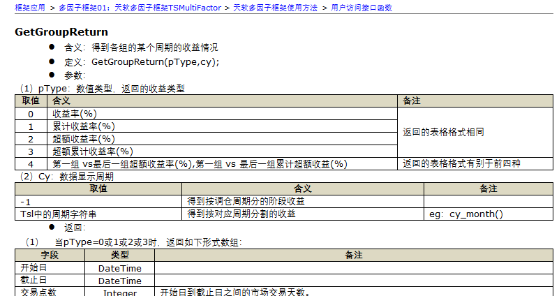
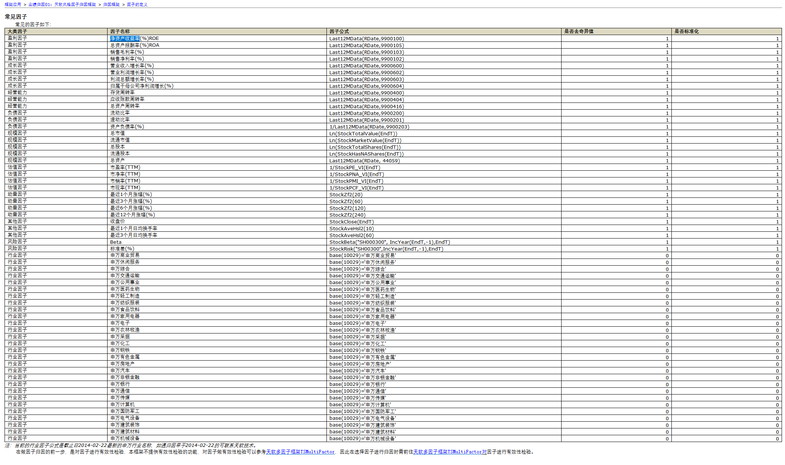

## 一、项目背景与研究目标

本项目旨在研究因子轮动策略，即不同因子在不同市场环境中的收益表现具有动态变化的现象，通过机器学习模型预测下一期各因子的表现强弱，从而动态分配因子权重，获得优于静态多因子组合的收益及风险控制能力。

研究目标如下：

1. 构建以上证50为基础的五类经典因子多空收益数据集。
2. 通过机器学习或深度学习模型预测下一期因子收益强弱。
3. 基于预测结果动态调整因子权重，实现因子轮动策略。
4. 在天软平台完成回测并与静态因子策略进行对比。
5. 引入LLM模型获取策略可解释性说明，增强模型透明度。
6. 最终形成一个可展示的研究成果与系统化流程。

------

## 二、任务清单与任务目标

任务 1：研究设计与基础准备
 任务目标：确定研究范围、数据来源、回测框架，建立统一工作环境。

任务内容：

1. 明确研究对象为上证50指数成分股。
2. 确定回测时间范围，2014-01 至 2024-01。
3. 确定调仓频率为月度。
4. 明确使用五类经典因子，包括动量、价值、质量、波动、规模。
5. 搭建天软环境与Python数据处理环境。

交付产物：研究设计文档与因子定义说明。

------

## 任务 2：构建因子数据及多空组合

任务目标：在天软平台上完成因子构建、分组与多空收益生成。

任务内容：

1. 使用上证50成分股作为股票池，动态更新。
2. 分别计算每个因子的截面因子值。
3. 对每个因子进行分组（建议5组，20%分位分组）。
4. 计算每一调仓期 G1−G5 多空收益。
5. 生成因子多空收益时间序列。
6. 汇总生成因子收益表 factor_longshort.csv。

交付产物：
 factor_longshort.csv
 包含字段: 日期, MOM, VAL, QLTY, VOL, SIZE




``````
Function hw5_q3();
Begin

    FactorArr:=array(
    ("因子名称":"最近20日涨幅","因子公式":"Stockzf2(20)","因子方向":1,"因子比例(%)":100));

    obj:= new MultiFactorClass();
    obj.FBegT:=20150101T;
    obj.FEndT:=20250101T;
    obj.FIndexId:='SH000016';
    obj.FCycle:=cy_month();
    obj.FFactorArr:=FactorArr;

    Ret:=obj.BackTest();
    GroupReturn := obj.GetGroupReturn(0,cy_month());
    TrailingReturn :=  obj.GetTrailingReturn(cy_month());
    SignificanceStatistics := obj.GetSignificanceStatistics(cy_month());
    group1_firstday := obj.GetGroupFactorValue(20220228T,1);
    group1_lastday := obj.GetGroupFactorValue(20231229T,1);
  
End;

//重新定义一个class，为了解决每次的基准都是当前截止日期的上证50
Type MultiFactorClass=class(TSMultiFactor)
    AllFactors;

    Function GetSamples(EndT); override;
    Begin
        return GetBKByDate(FIndexId, EndT);
    End;
End;

``````

我需要用的因子有：

```
一、动量类因子 Momentum
短期动量 MOM20 StockZf2(20)
中期动量 MOM120 StockZf2(120)
趋势强度 RSI RSI_f(14,0)

二、价值类因子 Value
市净率PNA 1/StockPNA_VI(EndT)
市盈率TTM 1/StockPE_VI(EndT)
股息率 StockDividendYieldRatio(EndT)


三、质量因子 Quality
净资产收益率ROE_TTM Last12MData(RDate,9900100)
营业利润增长率 Profit_Growth Last12MData(RDate,9900602)

四、风险因子 Volatility
波动率 STD_60 StockRisk("SH000016",IncYear(EndT,-1),EndT)

市场敏感度 Beta StockBeta("SH000016", IncMonth(EndT,-1),EndT)

```



------

## 任务 3：构造机器学习训练数据集

任务目标：将因子多空收益时间序列转换为机器学习模型可用的时间序列样本。

任务内容：

1. 读取 factor_longshort.csv。
2. 填补缺失值或剔除异常值。
3. 将因子收益按时间排序。
4. 使用滑动窗口构造训练样本，输入窗口为过去12期因子收益，输出为下一期因子收益。
5. 划分训练集与测试集。

交付产物：
 模型训练数据集 X_train, y_train, X_test, y_test

------

## 任务 4：构建因子轮动预测模型

任务目标：使用机器学习或深度学习预测下一期各因子表现。

任务内容：

1. 确定模型选择，例如 LSTM、Transformer 或传统机器学习模型。
2. 定义多任务回归模型，输出维度为因子数。
3. 使用训练集进行模型训练，使用 MSE 或 Huber loss。
4. 进行调参与模型选择。
5. 使用测试集获得预测结果。

交付产物：
 factor_prediction.csv
 包含字段: 日期, 预测值(MOM_pred, VAL_pred,...)

------

## 任务 5：将预测转化为因子权重

任务目标：将因子预测收益转化为动态因子配置权重。

任务内容：

1. 对每期预测因子收益使用 softmax 分配权重。
2. 确保权重均为正且总和为1。
3. 将权重输出为 factor_weights_dynamic.csv。
4. 权重频率与调仓频率一致。

交付产物：
 factor_weights_dynamic.csv
 包含字段: 日期, MOM_w, VAL_w, QLTY_w, VOL_w, SIZE_w

------

## 任务 6：天软平台动态因子回测

任务目标：在天软平台实现动态权重因子组合回测。

任务内容：

1. 在 TSMultiFactor 子类中重写 GetFactors(EndT)。
2. 根据当前调仓日读取 factor_weights_dynamic.csv 对因子进行动态赋权。
3. 设置回测参数与交易规则。
4. 获取回测收益、夏普比、最大回撤等指标。
5. 与静态等权多因子和单因子策略对比分析。

交付产物：
 回测分析报告与收益曲线数据

------

## 任务 7：引入LLM生成策略可解释性

任务目标：生成因子权重变化的自然语言解释，增强模型透明度。

任务内容：

1. 输入因子历史收益与模型预测。
2. 设计解释提示模板。
3. 调用LLM生成因子权重调整解释。
4. 保存解释文本用于展示。

交付产物：
 explanation.txt 或 explanation.csv

------

## 任务 8：总结分析与展示

任务目标：整理成完整的项目说明材料。

任务内容：

1. 描述因子轮动理论背景。
2. 展示数据处理流程及模型设计。
3. 展示回测结果与对比分析。
4. 展示LLM解释性输出。
5. 展示系统化流程可落地性。
6. 撰写结论与改进方向。

交付产物：
 项目报告稿、答辩PPT或展示网页

------

## 附注事项（建议）

1. 股票池与指数统一采用上证50，以保证因子构建与回测一致性。
2. 所有时间相关任务遵循月度频率，以降低噪声与过拟合风险。
3. 模型预测的目标为因子多空收益，不直接预测股票收益。
4. 模型输出使用softmax分配因子权重，以保证权重可解释与稳健性。
5. 天软回测基于动态权重模型，在策略层上体现轮动优势。
6. LLM用于结果解释，不参与模型训练与预测过程。

